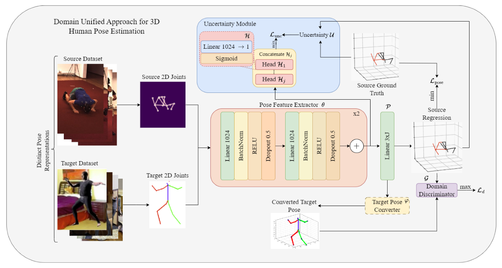

# DUA: A Domain-Unified Approach for Cross-Dataset 3D Human Pose Estimation

This repository holds the Pytorch implementation of [DUA: A Domain-Unified Approach for Cross-Dataset 3D Human Pose Estimation](https://www.mdpi.com/1424-8220/23/17/7312). If you find our code useful, please consider citing:

```
@Article{s23177312,
  AUTHOR = {Manesco, João Renato Ribeiro and Berretti, Stefano and Marana, Aparecido Nilceu},
  TITLE = {DUA: A Domain-Unified Approach for Cross-Dataset 3D Human Pose Estimation},
  JOURNAL = {Sensors},
  VOLUME = {23},
  YEAR = {2023},
  NUMBER = {17},
  ARTICLE-NUMBER = {7312},
  URL = {https://www.mdpi.com/1424-8220/23/17/7312},
  PubMedID = {37687768},
  ISSN = {1424-8220},
  DOI = {10.3390/s23177312}
}

```
## Graphical Abstract
<p align="center"></p>

## Introduction

We propose a novel method called Domain Unified approach, aimed at solving pose misalignment problems on a cross-dataset scenario, through a combination of three modules on top of the pose estimator: pose converter, uncertainty estimator, and domain classifier. Our method is evaluated on both the [Human3.6M](http://vision.imar.ro/human3.6m/description.php) and [SURREAL](https://www.di.ens.fr/willow/research/surreal/data/) datasets. For the domain adaptation techniques, our method employs the [Transfer Learning Library](https://github.com/thuml/Transfer-Learning-Library).

Parsed 3D human pose information from the SURREAL dataset was obtained from [Pose2Mesh](https://github.com/hongsukchoi/Pose2Mesh_RELEASE) and Human3.6M SMPL information was obtaining by performing the MoSH technique.


## Quick start

This repository is build upon Python v3.6. NVIDIA GPUs are needed to train and test. See [`requirements.txt`](requirements.txt) for other dependencies.

### Dataset setup

You can find the instructions for setting up the Human3.6M and results of 2D detections in [`data/README.md`](data/README.md). The code for data preparation is borrowed from [VideoPose3D](https://github.com/facebookresearch/VideoPose3D), in addition to the code of [SemGCN](https://github.com/garyzhao/SemGCN) for a few benchmarking models.

### Training from scratch

If you want to reproduce the results of our pretrained models, run the following commands.

For Martinez et al. with Human3.6M and Uncertainty:

```
python main_prob.py
```

For Martinez et al. with SURREAL and Uncertainty:

```
python train_surreal.py
```


For SemGCN with Human3.6M and uncertainty:

```
python main_gcn_prob.py --non_local --epochs 50
```

For DUA with Human3.6M:

```
python train_h36m_dan.py --epochs 200 --checkpoint 'checkpoint/h36_dua/'
```

For DUA with SURREAL:

```
python train_surreal.py  --epochs 200 --checkpoint 'checkpoint/sur_dua/'
```

For the conversion module with the desired output format:

```
python conversion.py --epochs 200 --checkpoint 'checkpoint/conversion_h36m_to_smpl/' --format 'h36m'
```

### Visualization

You can generate visualizations of the model predictions by running:

```
python viz.py --evaluate [checkpoint_location] --viz_subject S11 --viz_action SittingDown --viz_output surreal_training.gif --viz_size 3 --architecture linear
```

The script can also export MP4 videos, and supports a variety of parameters (e.g. downsampling/FPS, size, bitrate). See [`viz.py`](viz.py) for more details.

## Examples
<p align="center"></p>
<p align="center"> Cross-domain evaluation without our method </p>
<p align="center"></p>
<p align="center"> Cross-domain evaluation with DUA </p>

## Acknowledgement 

Part of our code is borrowed from the following repositories.

- [3d-pose-baseline](https://github.com/una-dinosauria/3d-pose-baseline)
- [3d_pose_baseline_pytorch](https://github.com/weigq/3d_pose_baseline_pytorch)
- [SemGCN](https://github.com/garyzhao/SemGCN)
- [Transfer-Learning-Library](https://github.com/thuml/Transfer-Learning-Library)
- [VideoPose3D](https://github.com/facebookresearch/VideoPose3D)

We thank to the authors for releasing their codes. Please also consider citing their works.
